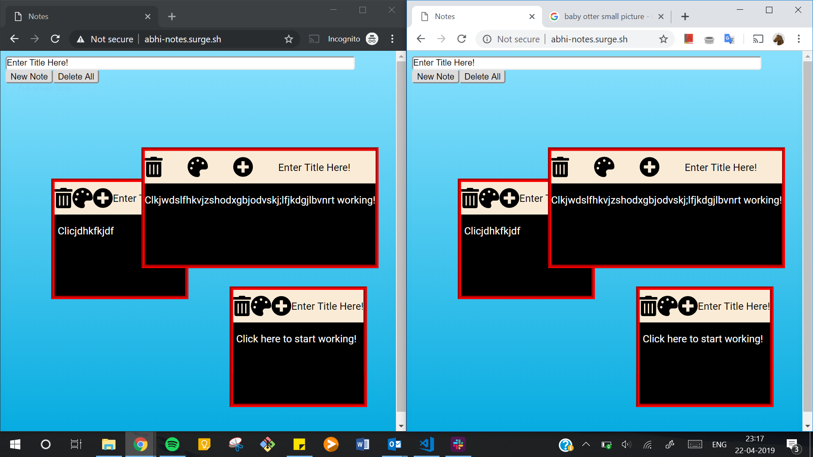

# Lab 3
## Abhimanyu Kapur

a couple sentence description about what you did
and what worked / didn’t work
any extra credit attempted

### Description
* A fun and ~ simple ~ notes app to be used by anyone!!!

### What Worked (or Didn't)
* Got a much better understanding of state and life cycle
* Planning components in advance and keeping it simple was helpful
* What didn't work was not using state well initially

### Extra Credit
* Notes stay within bounds of page
* Font awesome icons for buttons 
* Change note colors with pallete button
* Zindex as the below 2 points
* When editing, note is brought to front 
* When dragging, note brought to front
* Editable in markdown
* Plus button on Notes duplicates Notes
* Delete all button to delete all notes
* Groovy style (c'mon)

### Screenshots

